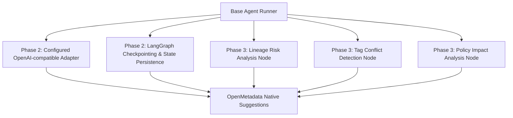

# Parallel Development Guide for `governance_agent` (Phase 2 & Phase 3)

This guide details how to accelerate development of Phase 2 and Phase 3 using multiple AI Coding Agents working in parallel.

---

## 1. Why Parallel Agent Development Works Now

With `governance_agent` extracted into a standalone project:
1. **Zero Backend Impact**: Code changes inside `governance_agent` do not touch FastAPI backend routes, Alembic migrations, or Ranger/Trino enforcement.
2. **Clear Boundaries**: All external communication goes through OpenMetadata MCP & REST APIs.
3. **High Parallelism**: Phase 2 (Provider & Memory expansion) and Phase 3 (Specialist Reasoning nodes) can be implemented by different AI agents simultaneously.

---

## 2. Phase 2 & Phase 3 Task Roadmap for AI Agents



---

## 3. Parallel Task Assignment Playbook

### Agent Prompt / Instruction 1: Configured LLM Adapter (Phase 2 Stream A)
> **Goal**: Keep one OpenAI-compatible provider adapter and configure its base URL, model, and machine credential through environment variables. The current deployment uses 9router.
> **Files**: `governance_agent/app/classifier.py`, `governance_agent/app/runner.py`, `governance_agent/tests/test_classifier.py`
> **Rule**: Maintain the `StructuredClassifier` protocol contract so `graph.py` remains provider-neutral. Do not add provider SDKs unless a future approved task requires them.

### Agent Prompt / Instruction 2: Lineage Risk Analysis Node (Phase 3 Stream B)
> **Goal**: Create `app/reasoning/lineage_risk.py` to analyze upstream lineage data sensitivity and propagate confidence scores.
> **Files**: `governance_agent/app/reasoning/lineage_risk.py`, `governance_agent/app/graph.py`
> **Rule**: Retrieve lineage graph via `OpenMetadataMCPClient.call_tool("get_entity_lineage", ...)`.

### Agent Prompt / Instruction 3: Metadata Conflict Detector Node (Phase 3 Stream C)
> **Goal**: Create `app/reasoning/conflict_detector.py` to check if a suggested tag conflicts with existing entity tags or glossary terms.
> **Files**: `governance_agent/app/reasoning/conflict_detector.py`
> **Rule**: Do not create suggestion if confidence is below threshold or if mutually exclusive tags exist.

---

## 4. Verification Workflow for All Parallel Agents

Before submitting code, each AI Agent must run:
```bash
conda activate dg_backend
cd governance_agent
pytest
```
